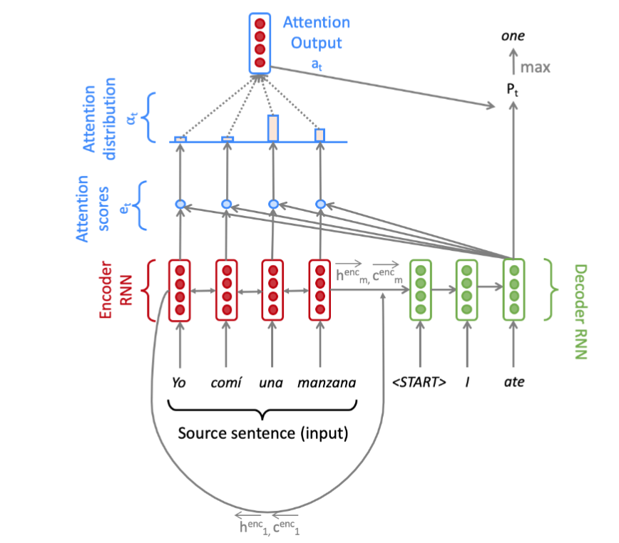
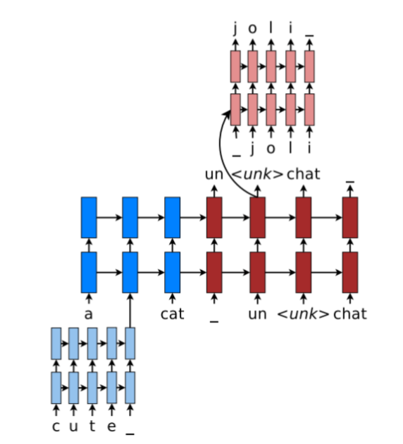
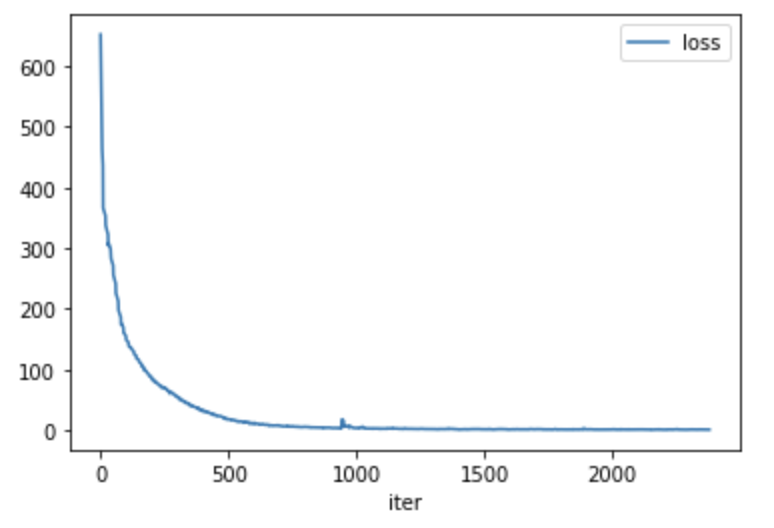
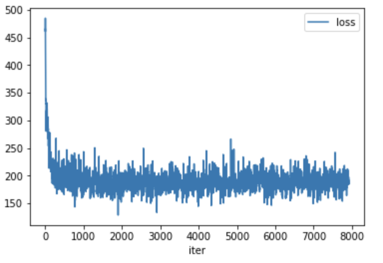

# Voice-To-Text
This project uses deep learning technologies to transfer voice to text. It is build with pytorch and based on the [cs224n-2019/assignment 5](https://web.stanford.edu/class/archive/cs/cs224n/cs224n.1194/). The technologies used in the project include 1Dconv, embedding, highway LSTM, Attention, beam search. The project uses [LJ-Speech-Dataset](https://keithito.com/LJ-Speech-Dataset/) to train and validate the model.

# Model Design

## Voice process

The sample rate voice in [LJ-Speech-Dataset](https://keithito.com/LJ-Speech-Dataset/) is 22k. First, the voice is resampled to 8000. Then the voice is splited into slices with size of 1k. The splited data is passed to 1DConv. Finally, the output of 1DConv is passed into a highway. The output of highway is passed into the Neural Machine Translation Model.


## Neural Machine Translation Model

The neural machine translation model has a  Bidirectional  LSTMEncoder and a Unidirectional LSTM Decoder and Multiplicative Attention and Character-based LSTM decoder. Please refer to [cs224n-2019 assignment 4,5](https://web.stanford.edu/class/archive/cs/cs224n/cs224n.1194/)

### Neural Machine Translation Model


### Character-based LSTM decoder

<!--  -->



## Training Model

### Download dataset and split data for train/dev/test

[LJ-Speech-Dataset](https://keithito.com/LJ-Speech-Dataset/)

Split data into dataset/train dataset/dev dataset/test. Each of the three folders should contains wav files and metadata.csv. All files should be in same folder.

### Build vocab

vocab is needed for training model. Please run the python script to build a vocab.


```python
from vocab import VocabEntry, Vocab
from utils import read_corpus_from_LJSpeech, get_voice_files_and_corpus, get_voice_files_and_corpus_by_indexes

corpus = []
for k, sent in read_corpus_from_LJSpeech('./dataset/train/metadata.csv', 'tgt'):
    corpus.append(sent)

entry = VocabEntry().from_corpus(corpus, 500000, 2)
vocab = Vocab(entry, entry)
vocab.save('./dataset/vocab_full.json')
```

### Run Jupyter notebok voice_to_text.ipynb to train
voice_to_text.ipynb

### Training Reports

| Loss of overfit training with 16 records        | Loss of training with 500 records           |
| ------------- | -------------|
| | |


